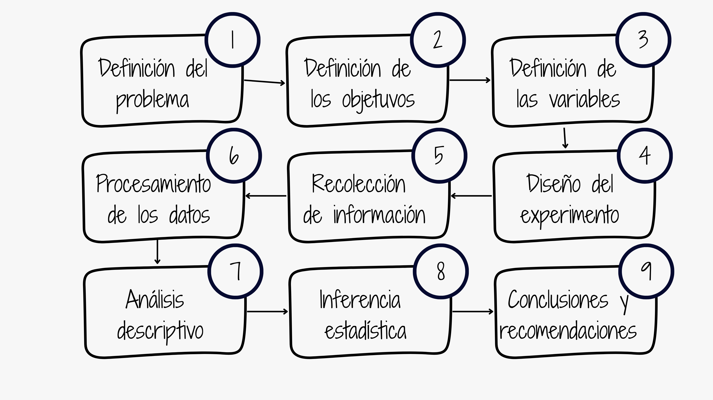

```{r setup, include=FALSE}
knitr::opts_chunk$set(echo = TRUE,comment = NA)
library(ggplot2)

# colores
source("init.R")

```

<br/><br/>


```{r, echo=FALSE, out.width="100%", fig.align = "center"}

```


<br/><br/>

# **Introducción**

<br/>

En esta unidad se  presenta  la **Metodología Estadística** como  estrategia que  permite  visualizar las diferentes etapas presentes en una investigación  o análisis de  datos :

<br/><br/>

<!-- 1. Definición del problema -->
<!-- 2. Definición de los objetivos -->
<!-- 3. Definición de las variables de interés -->
<!-- 4. Diseño del experimento -->
<!-- 5. Recolección de la información -->
<!-- 6. Procesamiento de información -->
<!-- 7. Análisis descriptivo -->
<!-- 8. Inferencia estadística -->
<!-- 9. Recomendaciones y conclusiones -->


```{r, echo=FALSE, out.width="80%", fig.align = "center"}

```


<br/><br/>


Tambien se hará especial referencia a la construcción, depuración  y documentación  de las bases de datos, acciones necesarias para un  buen  análisis de datos.

Con este propósito se hará uso del portal **Bases de Datos Abiertos Colombia**,  del lenguaje **R** y su IDE **RStudio**.

<br/><br/>

# **Objetivos de la unidad**

<br/>

Al finalizar la unidad los estudiantes estarán  en  capacidad de  RECONOCER los  pasos de la Metodología Estadística y podrán ESTRUCTURAR, LIMPIAR y DOCUMENTAR una  base de datos con  el fin de  garantizar los elementos  necesarios  para  realizar  un  procesamiento  de  datos. Para ello seleccionaran una base de datos. Adicionalmente propondrán un problema que les permita el desarrollo de la metodológica estadística. 

<br/><br/>

# **Duración**

<br/>

La presente unidad será desarrollada durante la primera semana del semestre ( 28 al julio al 3 de agosto de 2025). Ademas del material suministrado se podrá contar con el acompañamiento del profesor en tres sesiones (Lunes, Miércoles y Jueves) y de un monitor - a partir de la segunda semana de agosto. Los documentos requeridos para esta unidad deberán ser entregados a través de la plataforma **Brightspace** hasta el 3 de agosto.

Para alcanzar los objetivos planteados se propone realizar las siguientes actividades:

<br/><br/>

# **Cronograma de trabajo**

<br/>

|Actividad111   | Descripción                    | 
|:--------------|:-----------------------------  |
|Individual     |  **Metodología estadística:** : Formular un  problema que le permita  desarrollar un  ejercicio académico durante  el  semestre a través de  la recolección  de información (primaria o secundaria), Ademas de establecer los  objetivos y las  variables de  interés asociadas en dicho problema e identificar el tipo de  variable  y su  escala  de medición.  El resultado  de esta actividad deberá se entregado  en **archivo en formato pdf** con  nombre: **actividad111.pdf** en enlace ubicado en la plataforma Bs |
| Recursos      | **Metodología** |
|               | **Recurso 1.1**                 |
| Fecha         | 3 de agosto de 2025 |
| Hora          | 23:59 hora local    |

<br/> 

|Actividad112   | Descripción                    | 
|:--------------|:-----------------------------  |
|Individual     |  **Base de datos** : Cada estudiante deberá  buscar una  base de  datos  de su interés,  depuarla  y  documentarla  si es  necesario. A partir de la información  recolectada deberá construir la ficha técnica de  la base. El resultado  de esta actividad deberá se entregado  en **archivo en formato pdf** con  nombre: **actividad112.pdf** |
| Recurso       | Video: [**Como descargar datos abiertos**](https://youtu.be/lRftK2mL3Sw) 
|               | [**Recurso 1.1**](https://dgonxalex80.github.io/300MAE005D/recurso11.html)                    |
|               | Formato ficha :**Ficha técnica** |
|               | Excel |
|               | RStudio |
|Fecha          | 3 de agosto  2025 |
|Hora           |  23:59 hora local  |

<br/> 

|Actividad113   | Descripción                    | 
|:--------------|:-----------------------------  |
|Individual     |**Instalación de R y RStudio** : Para el  desarrollo  de las  actividades del curso deberán instalar [R CRAN](https://www.r-project.org/) y   [RStudio](https://rstudio.com/). Para su correcta instalación  existen varios videos en  YouTube que le permitirán realizarlo de una manera correcta   | 
|Recursos       | [Descargar e instalar R y RStudio 2021 -Video Rafa Gonzalez Gouveia](https://www.youtube.com/watch?v=Nmu4WPdJBRo) |
|               | [R download](https://cran.r-project.org/) |
|               | [RStudio download](https://rstudio.com/products/rstudio/download/) |
| Fecha         | 3 de agosto  2025 |
| Hora          | 23:59 hora local |

<br/><br/>

# **Criterios de evaluación**

<br/>

* Reconocer la relación existente ente la  definición del problema, el planteamiento de los objetivos y la  definición de las variables de interés dentro de la  Metodología Estadística.

* Reconocer e identificar los diferentes tipos de variables  y sus respectivas escalas de medición.

* Identificar la estructura de una base de datos

<br/> 


<br/><br/>

# **Entregables** 

<br/>

| Entregable |  Descripción                    |
|:--------------|:-----------------------------|
|**actividad111.pdf** | Documento que contenga: Formulación de problema propuesto, definición  de los objetivos y definición de variables de interés. En este último caso detallar para cada variable su  tipo ( cualitativa o cuantitativa ) y su escala de medición ( nominal, ordinal, de intervalo o de razón).|
|**actividad112.pdf**| Ficha técnica de  la base seleccionada |
|||
|**Fecha** | 3 de agosto  2025|
|**Hora límite**| 23:59  hora  local|
|||


<br/><br/><br/> 

<div class="box2 with-label">

#### Nombre del estudiante:

<br/>

### **Ficha técnica**

* **Concepto**: (contexto que oriente sobre el tema que aborda la base de datos)

* **Población**: (población de la cual se ha recogido la información)

* **Tamaño de la muestra**: (número de observaciones recogidas en la base de datos)

* **Instrumento de recolección** : (forma en que se recoge la información - puede ser implicito que se trata de un instrumento como encuesta, planilla, formulario)

* **Ubicación espacio-temporal**: (lugar y tiempo en el que se recoge la información)

* **Unidad estadística**: ( persona u objeto del cual se obtiene la información)

* **Variables**

<div class="box2 with-label">
| Variable                    | Tipo de variable | Tipo de escala        |
|-----------------------------|------------------|-----------------------|
| (nombre de la variable)     | cualitativa/     | nominal/ordinal/      |
|                             | cuantitativa     | de intervalo/de razón |
|                             |                  |                       |
|                             |                  |                       |
|                             |                  |                       |
|                             |                  |                       |
|                             |                  |                       |
|                             |                  |                       |
</div>

</div>

```{r, echo=FALSE, out.width="50%", fig.align = "center"}
# knitr::include_graphics("img/ficha.png")
```


