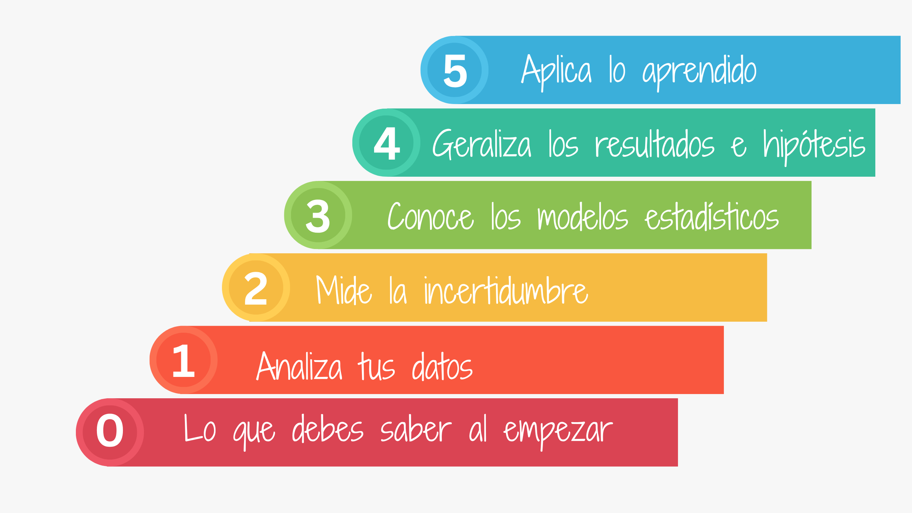
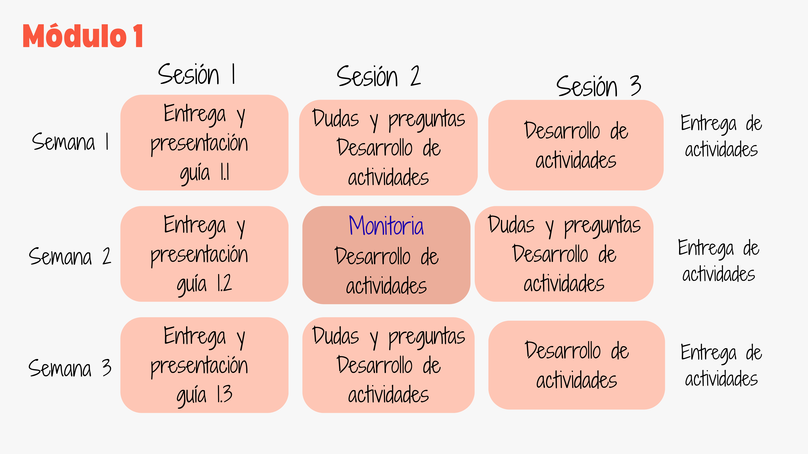
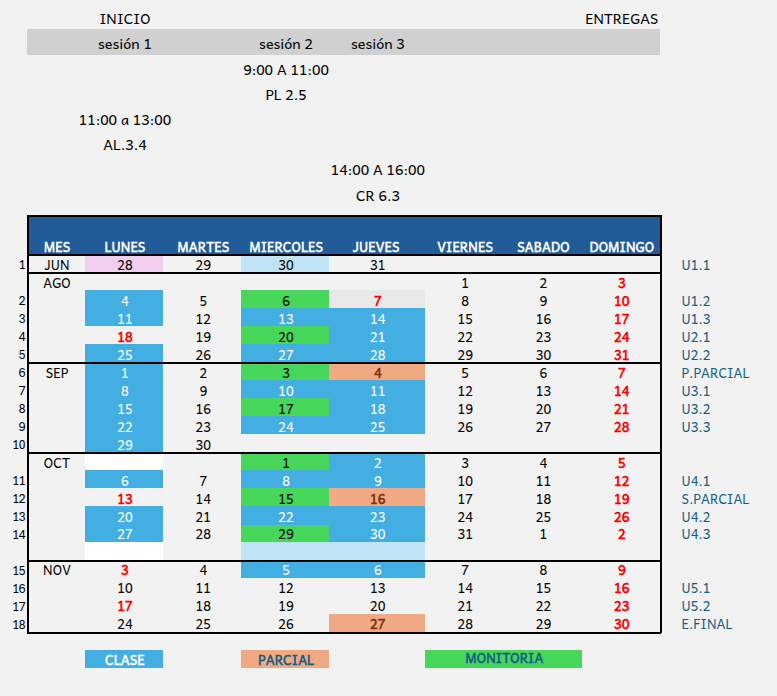

```{r setup, include=FALSE}
knitr::opts_chunk$set(echo = TRUE)

# colores
source("init.R")


```

<br/><br/>

```{r, echo=FALSE, out.width="100%", fig.align = "center"}
 #
```


<br/>


```{r, echo=FALSE, out.width="100%", fig.align = "center"}
 
```
<br/><br/>


# **Metodología**

<div class="box2"> 
```{r, echo=FALSE, out.width="110%", fig.align = "center"}

```

</div>

<br/><br/>

# **Calendario 2025-2**
<div class="box2">


<br/><br/>


```{r, echo=FALSE, out.width="100%", fig.align = "center"}

```

</div>


<br/><br/>

<div class="box2">

### **Profesor** : Daniel Enrique González Gómez 

* correo : dgonzalez@javerianacali.edu.co


### **Monitor** : 

</div>

<br/><br/>

# **Atención a Estudiantes**
<div class="box2">


```{r, echo=FALSE, out.width="100%", fig.align = "center"}
# 
```

</div>

<br/><br/>


# **Información supletorios**
<div class="box2">


```{r, echo=FALSE, out.width="70%", fig.align = "center"}
 # knitr::include_graphics("img/supletorio1.png")
```

</div>

<br/><br/>


```{r, echo=FALSE, out.width="100%", fig.align = "center"}
# knitr::include_graphics("img/calendario2023-1bre.png")
```


