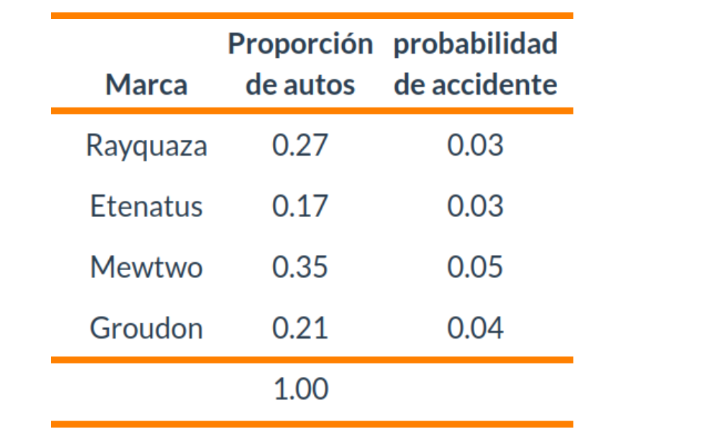

---
title: " "
subtitle: " " 
author: "dgonzalez "
output:
  html_document:
    toc: no
    toc_depth: 2
    toc_float: yes
    code_folding: hide
    theme: flatly
---    


```{r setup, include=FALSE}
options(htmltools.dir.version = FALSE)
knitr::opts_chunk$set(
  fig.width=9, fig.height=3.5, fig.retina=3,
  out.width = "100%",
  cache = FALSE,
  echo = TRUE,
  message = FALSE, 
  warning = FALSE,
  hiline = TRUE
)
# colores
source("init.R")

paleta4=c(c00,c10,c20,c30)


library(forcats)
library(patchwork)
library(lubridate)
library(ggplot2)
library(gridExtra)
library(cowplot)
library(summarytools)

#library(dviz.supp)
```


</br></br></br>

```{r, echo=FALSE, out.width="100%", fig.align = "left"}
knitr::include_graphics("img/banner02.png")
```
</br></br></br>


<div class="box1 with-label">
<div class="label">Problema 1</div>

</br>

:::: {style="display: flex;"}
::: {}

Una compañia de seguros de automóviles trabaja con cuatro tipo de autos :  Rayquaza, Etenatus, Mewtwo y Groudon, sobre los que cuenta con la información que se muestra en la siguiente tabla.

Construya un diagrama de árbol que represente la información suministrada y a partir de los resultados obtenidos ayude al gerente de la compaía quien esta interesado en conocer cual marca tiene mayor probabilidad de accidente si se conoce que ha tenido un accidente. Esto le ayudará a realizar ajustes en los precios de las polizas.
  
:::
::: {}


```{r, echo=FALSE, fig.align = "center"}

```

<!-- | Marca    |Proporción de autos       | probabilidad de accidente | -->
<!-- |:--------:|:------------------------:|:-------------------------:| -->
<!-- | Rayquaza | 0.27                     | 0.03                      | -->
<!-- | Etenatus | 0.17                     | 0.03                      | -->
<!-- | Mewtwo   | 0.35                     | 0.05                      | -->
<!-- | Groudon  | 0.21                     | 0.04                      | -->
<!-- |          | 1.00                     |                           | -->
:::
::::


</div>

<br/><br/><br/>

<div class="box1 with-label">
<div class="label">Problema 2</div>

</br>

Un dispositivo sirve para identificar una cierta enfermedad. Si alguien está enfermo, hay un 90 % de posibilidades de que la prueba sea positiva. Si no está enfermo hay todavía un 1 % de posibilidades de que la prueba sea positiva. Aproximadamente el 1 % de la población está enferma. Smith pasa la prueba y resulta positiva. La probabilidad de que tenga la enfermedad es? (Carmen Diaz-2005)

</div>

<br/><br/><br/>


<div class="box1 with-label">
<div class="label">Problema 3</div>

</br>


En una ciudad hay 60 hombres y 40 mujeres por cada 100 habitantes. La mitad de los hombres y una tercera parte de las mujeres fuman. Si se selecciona al azar un fumador, ¿qué es más probable, que sea hombre o mujer? (Carmen Diaz-2005)

</div>

<br/><br/><br/>


<div class="box1 with-label">
<div class="label">Problema 4</div>

</br>


En un grupo de 1000 sujetos se encontraron 500 sujetos aptos de los que 300 tenían inteligencia superior. De los 400 con inteligencia superior 300 resultaron aptos. ¿Son los sucesos A: “ser superior a la media en inteligencia” y B “ser apto
en rendimiento” independientes? (Botella, León y San Martín, 1993, p. 283)

</div>


<br/><br/><br/>

<div class="box1 with-label">
<div class="label">Problema 5</div>

</br>

En una población de plantas, el 25% tiene flores rojas, el 50% tiene flores amarillas, y el 25% tiene flores blancas. Se sabe que las plantas con flores rojas tienen un 80% de probabilidad de ser polinizadas, las plantas con flores amarillas tienen un 60% de probabilidad de ser polinizadas, y las plantas con flores blancas tienen un 40% de probabilidad de ser polinizadas. Si se selecciona al azar una planta polinizada, ¿cuál es la probabilidad de que tenga flores rojas?

</div>

<br/><br/><br/>

<div class="box1 with-label">
<div class="label">Problema 6</div>

</br>

En un estudio sobre prótesis de rodilla, se analizan dos tipos de prótesis: prótesis A y prótesis B. En el estudio, se encontró que el 40 % de los pacientes utilizan la prótesis A y el 60% utilizan la prótesis B. Además, se supervisa que el 90% de los pacientes que utilizan la prótesis A experimentan una mejora significativa en su movilidad, mientras que el 75% de los pacientes que Utilizan la prótesis B experimentan la misma mejora. Si se selecciona al azar un paciente que ha experimentado una mejora significativa en su movilidad, ¿cuál es la probabilidad de que este paciente esté utilizando la prótesis A?

</div>

<br/><br/><br/>


